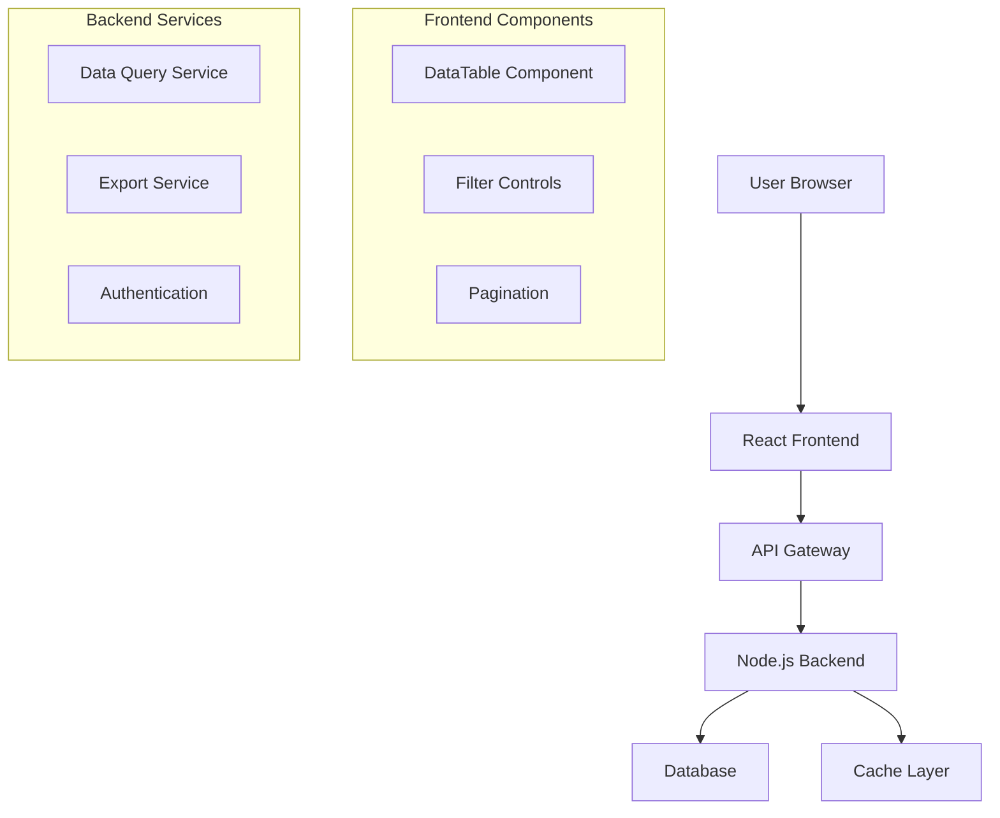
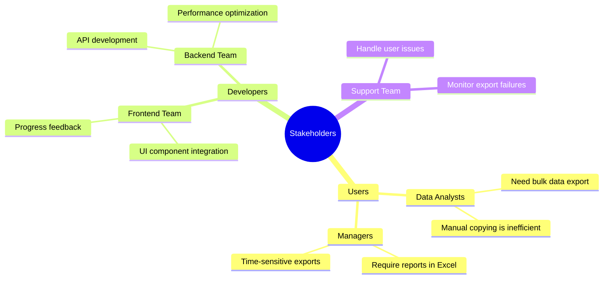
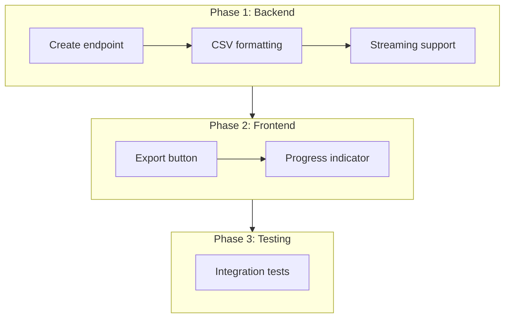

# Operation: Add Export to CSV Feature

## Background

### Problem Statement

Users can view data tables in the web UI but cannot export data. Support requests show users are manually copying data to spreadsheets. Need export functionality to improve user experience.

### Goals

- Add "Export to CSV" button that exports currently filtered/sorted table data
- Handle large datasets (up to 100k rows)
- Works across all data tables in the application
- Downloads file with appropriate filename

### Approach

Client-initiated export with server-side streaming:

1. User clicks "Export" button
2. Frontend sends current filter/sort state to backend
3. Backend streams CSV data
4. Browser downloads file

### References

- [Design Log: Add Export to CSV Feature](.assistant/design_logs/dl_003_export_csv.md)

### Current System Architecture

The application uses a standard web architecture with React frontend and Node.js backend. Data tables are rendered client-side with pagination and filtering.

### Requirements Analysis

| Requirement | Priority | Complexity | Notes |
| - | - | - | - |
| CSV Export Button | High | Low | Must be visible on all data tables |
| Filter/Sort Preservation | High | Medium | Export should match current view |
| Large Dataset Support | High | High | Handle up to 100k rows efficiently |
| Progress Indicator | Medium | Medium | Show progress for large exports |
| Error Handling | High | Low | Clear error messages for failures |
| Cross-browser Compatibility | Medium | Low | Works in Chrome, Firefox, Safari |
| File Naming | Low | Low | Automatic filename generation |

### Stakeholder Analysis

### Risk Assessment

| Risk | Probability | Impact | Mitigation |
| - | - | - | - |
| Memory issues with large datasets | High | High | Implement streaming approach |
| Browser timeout on slow connections | Medium | Medium | Add progress indicator and chunking |
| CSV formatting errors | Low | Medium | Comprehensive unit tests |
| Security vulnerabilities | Low | High | Input validation and sanitization |
| Performance degradation | Medium | Medium | Load testing and optimization |

## Phases

**Phases overview**:

- Phase 1 (3 tasks): Backend CSV Export - Create the API endpoint and CSV formatting utilities
- Phase 2 (2 tasks): Frontend Integration - Add UI components and handle API communication
- Phase 3 (1 task): Testing & Polish - Comprehensive testing and final adjustments

### Phase 1: Backend CSV Export

Implement the server-side export functionality including the API endpoint, CSV formatting, and streaming for large datasets.

**Definition of Done (D.O.D.)**:

- [x] Export endpoint accepts filter/sort parameters
- [x] CSV output is correctly formatted with headers
- [x] Streaming works for datasets > 10k rows
- [x] Unit tests cover all edge cases

#### P1/Task 1: Create Export Endpoint

Create the POST endpoint for initiating CSV exports.

**Files Involved**:

- `src/api/export.ts`
- `src/api/routes.ts`

**P1/Task 1 Subtasks**:

- [x] Review existing API patterns in the codebase
- [x] Create `src/api/export.ts` with endpoint handler
- [x] Register route in `src/api/routes.ts`
- [x] Add request validation for filter/sort parameters
- [x] Write unit tests for endpoint

**P1/Task 1 Lessons Learned**:
Used existing validation middleware pattern from other endpoints. Added explicit type checking for sort order to prevent injection.

#### P1/Task 2: Implement CSV Formatting

Create utility functions for formatting data as CSV.

**Files Involved**:

- `src/utils/csv.ts`

**P1/Task 2 Subtasks**:

- [x] Review CSV spec requirements (RFC 4180)
- [x] Create `formatCSV` function for small datasets
- [x] Handle special characters (quotes, commas, newlines)
- [x] Write unit tests

**P1/Task 2 Lessons Learned**:
Edge case: field values containing both quotes and newlines required double-escaping. Added specific test case.

#### P1/Task 3: Add Streaming Support

Implement streaming for large datasets to avoid memory issues.

**Files Involved**:

- `src/api/export.ts`
- `src/utils/csv.ts`

**P1/Task 3 Subtasks**:

- [x] Create `streamCSV` generator function
- [x] Modify endpoint to use streaming response
- [x] Add chunk size configuration
- [x] Test with 100k row dataset
- [x] Verify D.O.D. checklist for Phase 1

**P1/Task 3 Lessons Learned**:
Initial chunk size of 1000 rows caused noticeable pauses; reduced to 500 for smoother progress updates.

### Phase 2: Frontend Integration

Add the Export button component and integrate with the backend API.

**Definition of Done (D.O.D.)**:

- [ ] Export button visible on all data tables
- [ ] Progress indicator shows for exports > 5k rows
- [ ] Error messages display clearly to user
- [ ] Download triggers automatically with correct filename

#### P2/Task 1: Create Export Button Component

Build the reusable Export button component.

**Files Involved**:

- `src/components/ExportButton.tsx`
- `src/components/DataTable.tsx`

**P2/Task 1 Subtasks**:

- [x] Review existing button component patterns
- [x] Create `ExportButton.tsx` with loading state
- [x] Integrate into `DataTable.tsx`
- [x] Add component tests

**P2/Task 1 Lessons Learned**:
Reused existing `ActionButton` base component for consistency.

#### P2/Task 2: Add Progress Indicator

Implement progress tracking for large exports.

**Files Involved**:

- `src/components/ExportButton.tsx`
- `src/components/ProgressBar.tsx`

**P2/Task 2 Subtasks**:

- [ ] Create progress bar component (or reuse existing)
- [ ] Track download progress from streaming response
- [ ] Show progress when estimated rows > 5k
- [ ] Add cancel functionality
- [ ] Verify D.O.D. checklist for Phase 2

**P2/Task 2 Lessons Learned**:

-

### Phase 3: Testing & Polish

Comprehensive testing across browsers and data scenarios.

**Definition of Done (D.O.D.)**:

- [ ] All unit tests passing
- [ ] Integration tests cover main user flows
- [ ] Tested in Chrome, Firefox, Safari
- [ ] Performance acceptable for 100k rows

#### P3/Task 1: Integration Testing

Create end-to-end tests for the export feature.

**Files Involved**:

- `tests/integration/export.test.ts`
- `tests/fixtures/large-dataset.json`

**P3/Task 1 Subtasks**:

- [ ] Review existing integration test patterns
- [ ] Create test fixture with various data sizes
- [ ] Test filter/sort combinations
- [ ] Test error scenarios (network failure, timeout)
- [ ] Cross-browser manual testing
- [ ] Verify D.O.D. checklist for Phase 3

**P3/Task 1 Lessons Learned**:

-

## Lessons Learned during Operation

- Streaming approach proved essential for large datasets; initial batch approach caused memory issues
- Progress indicator threshold lowered from 10k to 5k rows based on user feedback during testing
